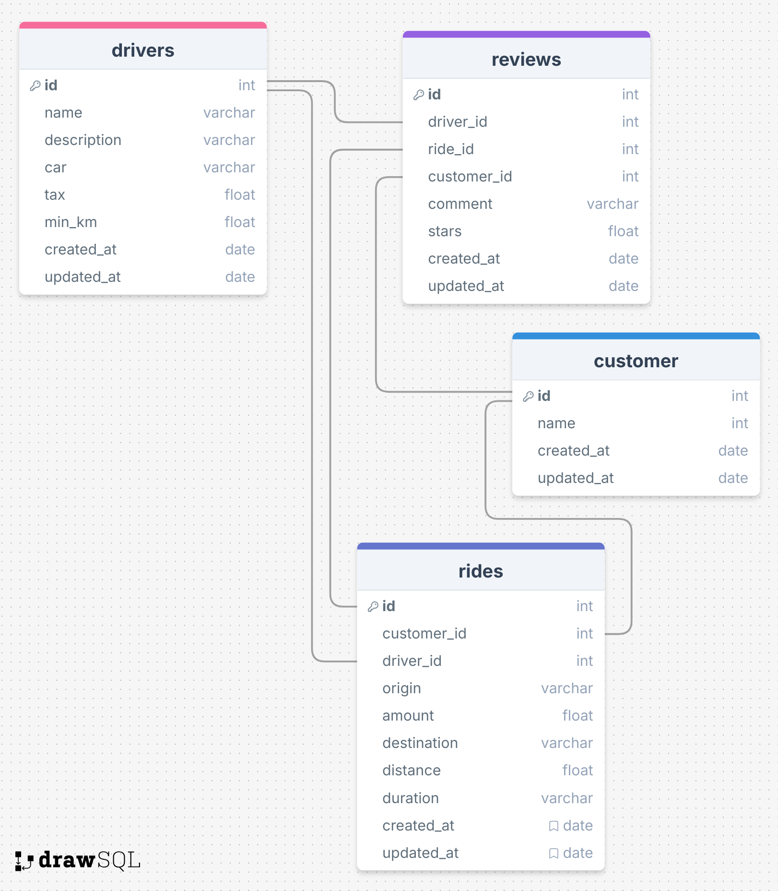

## Introdução

Projeto taxi-app para o processo seletivo da shopper.com.br.

### instalaçao 

Você precisará ter o GIT instalado na sua máquina, e, após isso, clonar este repositório:

```sh
   git clone https://github.com/Danielrl98/shopper-challenger-taxi-app-backend.git
```

```sh
   cd shopper-challenger-taxi-app-backend
```

Você precisará ter o Docker e Docker compose na sua máquina, após isso, executar o comando na pasta raiz do projeto:

```
    docker compose up
```

### Requisitos

habilitar "Google maps Api" no google cloud

habilitar "Distance Matrix Api" no google cloud

### Variáveis de ambiente

GOOGLE_API_KEY

### Estrutura do banco de dados



### Endpoints

POST /ride/estimate

Descrição: Calcula a rota de um ponto ao outro e retorna os detalhes da corrida.

corpo da requisição:

{
   customer_id: number,
   origin: string,
   destination: string,
}

retorno esperado:

{
   customer_id: string,
   rides: [
      {
         id: number,
         date: datetime,
         origin: string,
         destination: string,
         distance: number,
         duration: string,
         driver: {
            id: number,
            name: string
         },
         value": number
      }
   ]
}

PATCH /ride/confirm

Descrição: Responsável por confirmar a corrida

corpo da requisição:

{
   customer_id: string,
   origin: string,
   destination: string,
   distance: number,
   duration: string,
   driver: {
      id: number,
      name: string
   },
   value: number
}

retorno esperado:

{
   success: true
}

GET /ride/{customer_id}?driver_id={id do motorista}

Descrição: Responsável por lista todas as corridas

Retorno esperado:

{
   customer_id: string,
   rides: [
      {
         id: number,
         date: datetime,
         origin: string,
         destination: string,
         distance: number,
         duration: string,
         driver: {
            id: number,
            name: string
         },
         value: number
      }
   ]
}